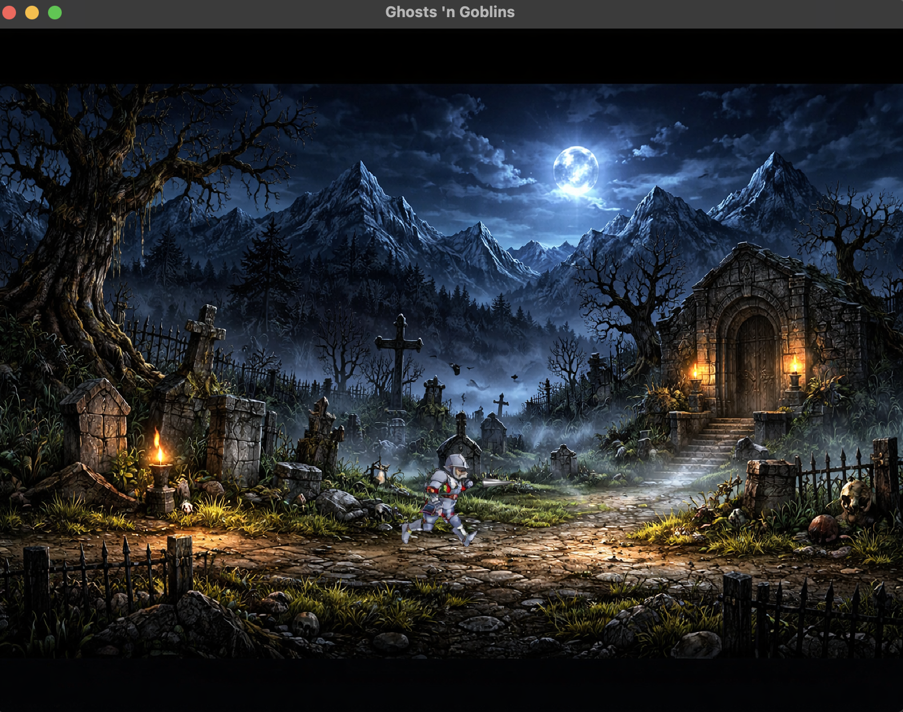

# Ghosts Game (Tribute Port)

## Purpose

This project aims to build a **basic, respectful tribute port** inspired by the classic *Ghosts 'n Goblins* experience.

The goal is not to replicate the original game pixel-by-pixel, but to capture its spirit:

- dark gothic atmosphere
- side-scrolling action feel
- unforgiving arcade-style pacing
- iconic knight-vs-horror fantasy tone

## Vision for the Basic Port

The intended first playable version should deliver the core loop of the original style:

- Arthur-like knight character movement (left/right, jump, attack)
- continuous horizontal stage scrolling
- graveyard/night-themed environments
- simple enemy waves with classic pressure
- projectile combat with precise timing
- player damage/death cycle true to old-school difficulty

## Design Principles

- **Respect the original legacy:** keep the tone and challenge recognizable.
- **Modern technical base:** implement with Java + LibGDX + Maven for maintainability.
- **Small incremental milestones:** ship a playable slice early, then expand.
- **Gameplay first:** prioritize controls, feel, and readability over feature bloat.

## Recent Architecture Updates

- **Decoupled rendering contract:** character and obstacle domain objects now expose render payloads through `Drawable` + `RenderData`, while `GhostsGame` owns the actual `SpriteBatch.draw(...)` calls.
- **General collision pipeline:** gameplay interactions are now resolved through a generic collision package (`Collider`, `CollisionLayer`, `CollisionPair`, `CollisionManager`) computed every frame.
- **Attack hitbox as first-class collider:** Arthur exposes both body and punch colliders, enabling collision-driven melee resolution without hardcoded pair-specific distance checks in the game loop.
- **Extensible collision layers:** current runtime uses `PLAYER`, `PLAYER_ATTACK`, `ENEMY`, and `OBSTACLE`, with `PICKUP` already reserved for future features.

## Long-Term Direction

After the basic port is stable, the project can evolve with:

- multiple level sections
- additional enemy archetypes and bosses
- refined animation and effects
- audio/music inspired by retro arcade energy

This repository is a homage project focused on recreating the essence of a legendary classic through a modern Java game development stack.
